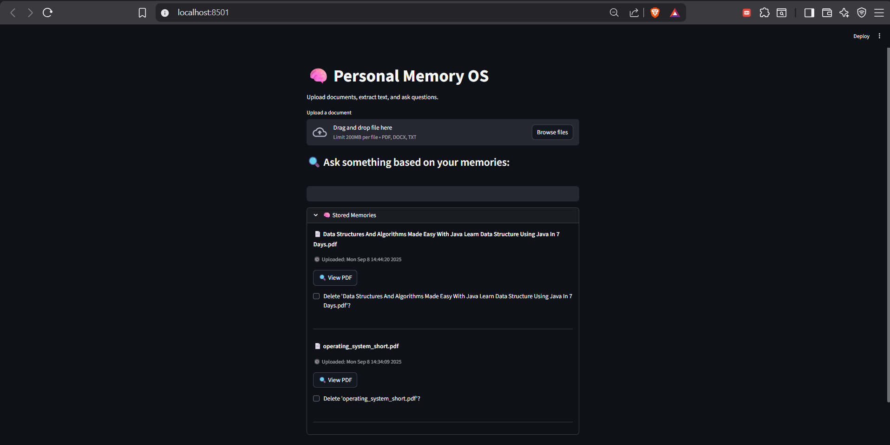
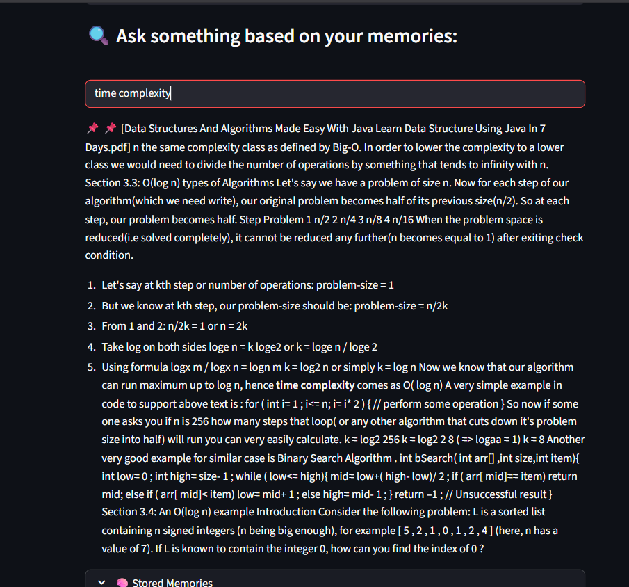
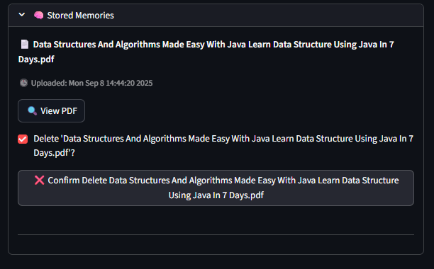

# 🧠 Personal Memory OS  

**Personal Memory OS** is a local AI assistant built with **Python** and **Streamlit**, designed to help you upload, extract, and organize your knowledge efficiently.  
It supports **PDF**, **TXT**, and **DOCX** files — automatically extracting their text and saving it into a structured `memory.json` file that acts as your personal searchable memory.  

---

## 🚀 Features  

- **📂 File Upload & Extraction:** Upload PDF, TXT, or DOCX files. Extracts text using `PyMuPDF`, `python-docx`, and `chardet`.  
- **💾 Memory Management:** Stores cleaned and processed text inside a persistent local memory file (`memory.json`).  
- **🔍 Keyword Search:** Quickly search for specific terms or phrases across your saved content.  
- **🧩 Modular Design:** Clean architecture with separate modules for file reading, memory storage, and search operations.  
- **🌐 Streamlit UI:** Intuitive web-based interface for file uploads, viewing, and searching through memory.  

---

## 🛠️ Tech Stack  

| Category | Tools / Libraries |
|-----------|-------------------|
| Language | Python |
| Framework | Streamlit |
| File Handling | PyMuPDF, python-docx, chardet |
| Data Storage | JSON |
| UI | Streamlit Components |
| Version Control | Git + GitHub |

---

## 📸 Screenshots  

| Upload Interface | Search Feature | Memory Management |
|:----------------:|:--------------:|:-----------------:|
|  |  |  |

---

## 🧱 Folder Structure  

## 🧱 Folder Structure

📁 **personal-memory-os/**
- 📂 `data/`
  - 🧠 `memory.json`
- 📂 `memory_engine/`
  - 📄 `file_reader.py`
  - 📄 `memory_store.py`
  - 📄 `search.py`
- 🖼️ `screenshots/`
  - 📸 `ui_look.png`
  - 📸 `searching.png`
  - 📸 `deletion.png`
- 🧾 `app.py`
- 🧩 `requirements.txt`
- 📝 `README.md`
- 🚫 `.gitignore`


---

## ⚙️ Setup & Run Locally  

### 1️⃣ Clone the Repository  
```bash
git clone https://github.com/adabismail/personal-memory-os.git
cd personal-memory-os

2️⃣ Create a Virtual Environment
python -m venv venv
venv\Scripts\activate

3️⃣ Install Dependencies
pip install -r requirements.txt

4️⃣ Run the App
streamlit run app.py


Then open the local URL shown in the terminal (usually http://localhost:8501
).

🧭 Future Enhancements

🧩 Text chunking and semantic embeddings for contextual search

🤖 GPT-powered Q&A for intelligent responses

🔍 Local vector search and personal knowledge graph

👨‍💻 Author

Adab Ismail
📍 NIT Srinagar
🔗 LinkedIn

📧 adabismail000@gmail.com

⭐ If you found this project useful, consider giving it a star!


---

✅ Copy → Paste → Commit → Push — done.  
Your GitHub page will now look clean, professional, and fully structured.